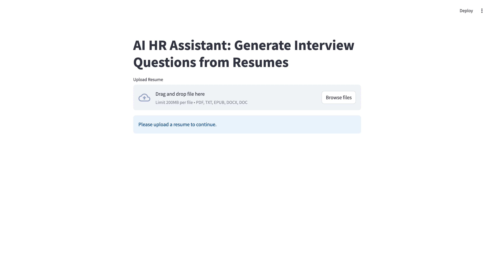

# HR Assistant

The **HR Assistant** is an AI-powered tool designed to assist HR professionals in the interview process. It takes a resume as input and generates relevant interview questions based on the candidate's skills, work experience, projects, and other key details. Additionally, it leverages OpenAI's Text-to-Speech (TTS) model to generate voice notes for the interview questions, making the process more interactive and engaging.

## Key Features:
- **Resume Upload**: Upload a resume (PDF/DOCX), and the tool will extract key information, including skills, experience, education, and projects.
- **Automatic Question Generation**: Based on the extracted information, the tool generates relevant interview questions to assess the candidate’s suitability for the role.
- **Voice Notes for Questions**: Uses OpenAI’s Text-to-Speech (TTS) model to convert the generated questions into voice format, providing an audio version for interviewers.
- **Interactive User Interface**: Built with **Streamlit** for a seamless and user-friendly experience.
- **Customizable Question Sets**: Generate different sets of questions for various roles or job descriptions by uploading different resumes.

## App Screenshot:
Here’s how the app looks when used:



## Technologies Used:
- **Python**: Core language for backend development.
- **OpenAI API**: Used for generating interview questions and text-to-speech (TTS) functionality.
- **Streamlit**: Web framework for building the user interface.
- **Pandas**: For data manipulation and processing resume information.
- **SpeechRecognition & Pyttsx3**: For text-to-speech functionality.

## How It Works:
1. **Upload Resume**: The user uploads a resume (PDF or DOCX format) to the app.
2. **Resume Parsing**: The app uses natural language processing (NLP) to parse the resume and extract key details like skills, projects, and work experience.
3. **Generate Questions**: Based on the extracted details, the app generates relevant interview questions using OpenAI's GPT model.
4. **Voice Output**: The generated questions are then converted into voice notes using OpenAI’s TTS models, providing an audio format for easier use in virtual or in-person interviews.

## Installation Instructions:

### Prerequisites:
- Python 3.x
- Pip (Python package manager)

### Steps:
1. Clone this repository to your local machine:
   ```bash
   git clone https://github.com/yourusername/Interview-Assistant.git
