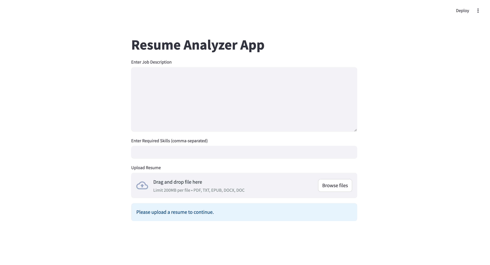

# Resume Analyzer

The **Resume Analyzer** tool is designed to help employers and recruiters evaluate resumes quickly and accurately. By analyzing the candidate's skills and experience, it provides a **match percentage** score based on specific job requirements, making the hiring process more efficient.

## **Key Features**:
- **AI-Powered Resume Matching**: The tool analyzes resumes and matches them to job descriptions using machine learning algorithms.
- **Match Percentage Score**: Provides a score indicating how well a candidate's resume matches the job requirements.
- **Interactive User Interface**: Built with Streamlit for real-time interaction.


## App Screenshot:
Here’s how the app looks when used:



  
## **Technologies Used**:
- **Python**: Core programming language for backend development.
- **OpenAI API**: Used for intelligent resume parsing and analysis.
- **Streamlit**: Web framework for building the user interface.
- **Pandas & Scikit-learn**: Used for data manipulation and analysis.

## **Getting Started**:

### Prerequisites:
Before running the app, ensure that you have the following installed:
- Python 3.x
- Required Python packages from `requirements.txt`

### Installation:

1. Clone the repository:
   ```bash
   git clone https://github.com/your-username/interview-assistant.git
   cd interview-assistant/Resume Analyzer

2. Install the required dependencies:
    ```bash
   pip install -r requirements.txt

3. Run the Streamlit app:
    ```bash
   streamlit run app.py


### How it Works:

    Upload a candidate’s resume (PDF or DOCX).

    The system will automatically analyze the content and compare it against predefined job requirements.
    
    A match percentage score will be displayed based on how well the resume aligns with the job description.

